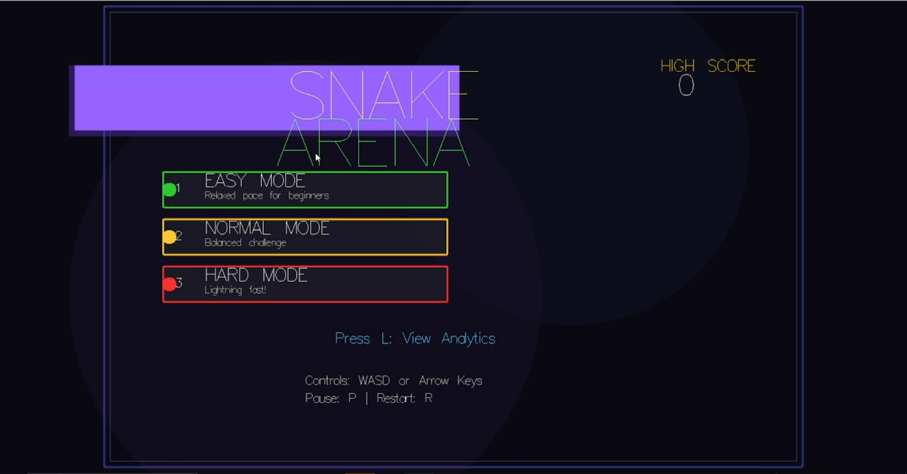
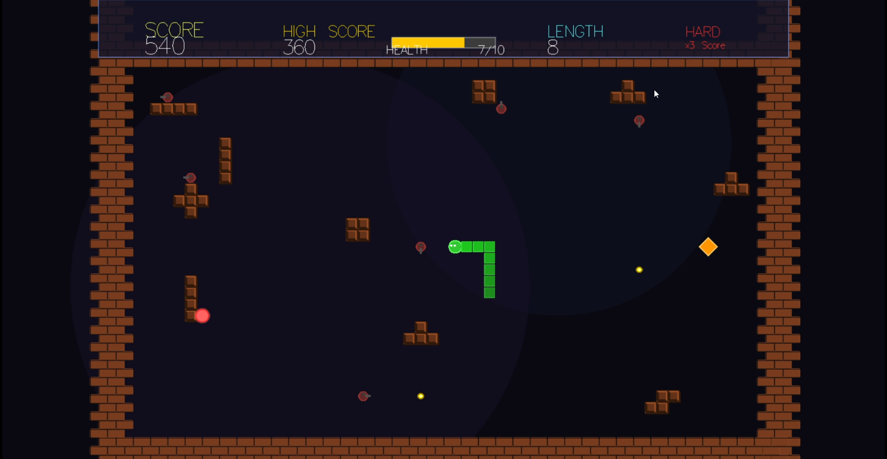

# Snake Arena

A pure-functional real-time Snake game with a graphical UI and Replay Analytics, built in Haskell.

## Overview
Snake Arena allows players to control a snake on a 2D grid, collecting food and power-ups while avoiding collisions. It features a completely pure game loop, replay logging, and an analytics pipeline.







## Features
- **Pure Functional Logic**: Game state updates are deterministic and pure.
- **Graphical UI**: Built with `gloss`.
- **Power-Ups**: Speed Boost (Cyan) and Score Multiplier (Orange).
- **Replay System**: Automatically saves game logs.
- **Analytics**: Load and view statistics from past games.

## Installation
Prerequisites: `cabal`, `ghc`, and system libraries for `gloss` (OpenGL, GLUT).

```bash
# Update package lists
sudo apt-get update

# Ubuntu dependencies for gloss
sudo apt-get install libgl1-mesa-dev libglu1-mesa-dev freeglut3-dev

# For headless servers (optional - only if no display available)
sudo apt-get install xvfb

# Build the project
cabal update
cabal build
```

## Usage

### Running on a Machine with Display
To run the game on a system with a graphical display:
```bash
cabal run snake-arena
```

### Running on a Headless Server
If you're on a server without a display (e.g., via SSH), use `xvfb-run`:
```bash
xvfb-run -a cabal run snake-arena
```

**Note**: On headless servers, the game will run but you won't be able to see or interact with it. For actual gameplay, run the game on a machine with a display, or set up VNC/X11 forwarding.

### Controls
- **Menu**:
  - `1`: Easy Mode
  - `2`: Normal Mode
  - `3`: Hard Mode
  - `L`: Load Analytics (Output to Console)
- **In-Game**:
  - `WASD` / `Arrow Keys`: Move
  - `P`: Pause
- **Game Over**:
  - `R`: Return to Menu

## FP Concepts
- **Immutability**: The `GameState` is never mutated, only tranformed by `step`.
- **Pure Functions**: `DataTypes` and `Processing` modules are entirely pure.
- **ADTs**: `Outcome`, `PowerType`, `Direction` model the domain strictly.
- **IO Separation**: IO is isolated in `Main` and `IOHandler`.

## File Structure
- `src/Main.hs`: Entry point, UI loop.
- `src/Processing.hs`: Pure game engine.
- `src/DataTypes.hs`: Type definitions.
- `src/IOHandler.hs`: Replay I/O.
- `src/Utils.hs`: Helpers.
